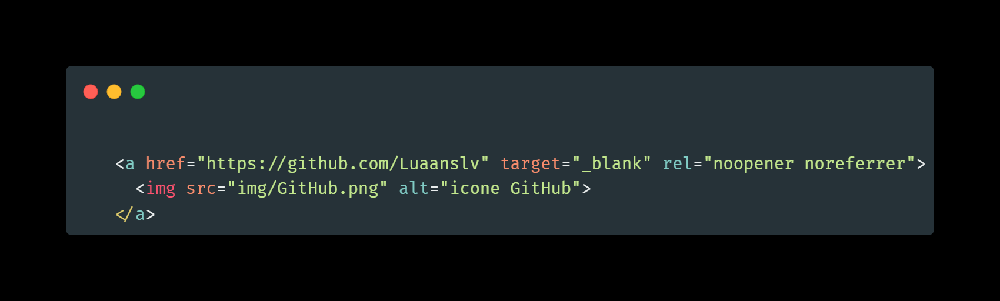
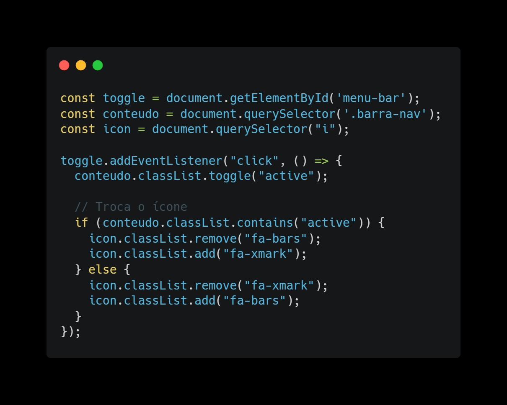

<h1>🚀 Portfólio do Desenvolvedor Front-End</h1>

<a  href="https://luaanslv.github.io/Portfolio/" target="_blank" title="Meu portfolio" rel="noopener noreferrer">👉 Clique aqui para conhecer meu portfólio!</a>
<h2>🧠 Sobre o Projeto</h2>

Criei este site com o objetivo de exibir meus projetos de front-end, servindo também como um espaço onde posso colocar em prática e refinar o que aprendi no trabalho e nos meus estudos. A forma como o projeto está organizado dá prioridade a aspectos cruciais do desenvolvimento front-end, como a divisão em módulos, a adaptação a diferentes telas e aprimorar a experiência de quem usa. Além disso, adotei métodos eficazes para controle de versão, testes automáticos e melhoria do desempenho, assegurando que as soluções sejam eficazes, possam crescer e sejam fáceis de manter.

<h2>🤔 Explicação do código</h2>

<h3>🎨 CSS</h3>

Pratiquei e entendi sobre o display flex, foi feito alinhamento de containers e distribuição de espaço com essa propriedade.

<h3>🔒Segurança</h3>

Foi utilizado em todos os links que direciona o usuário para uma página extena os paramentros <strong>rel="noopener noreferrer"</strong>.  O paramentro noopener impede que a nova aba tenha acesso á aba original pelo window.opener.   Enquanto o noreferrer remove o referer (origem) enviado á nova aba.

<h3>📱 Menu Mobile</h3>

 Foi utilizada a <strong>arrow function</strong> para colocar um evento de clique no botão de menu mobile para abrir. Caso o usuário clique, a navegação irá receber uma classe <strong>'.active'</strong> para abrir e, caso ele clique no botão de saída, a classe volta à origem. Além de fazer a troca de ícone de menu para o botão de saída, foi utilizada a troca de classe <strong>'fa-bars'</strong> para <strong>'fa-xmark'</strong>.

<h3>📚 Biblioteca</h3>

Utilizei a biblioteca <strong>Font Awesome</strong> para adicionar ícones estilosos e modernos à interface.

<h2>🎯 Seções do Projeto</h2>

<ul>
    <li>HOME</li>
    <li>PROJETOS</li>
    <li>CONHECIMENTOS</li>
</ul>

<h2>⚙️ Técnologias utilizadas</h2>
<ul>
    <li>HTML</li>
    <li>CSS</li>
    <li>FIGMA</li>
    <li>Javascript</li>
</ul>
